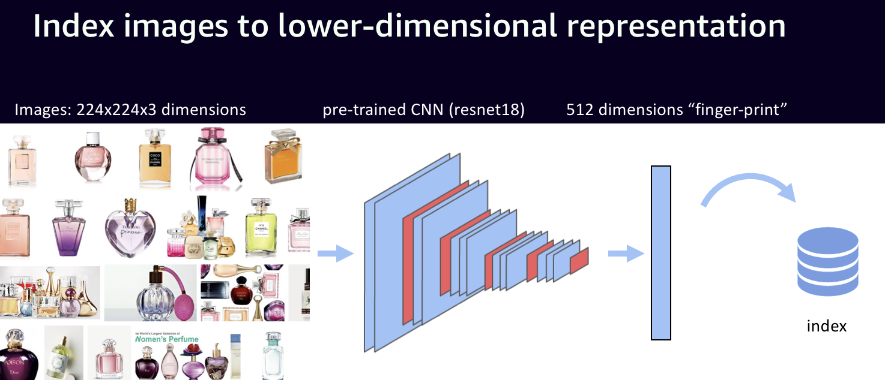
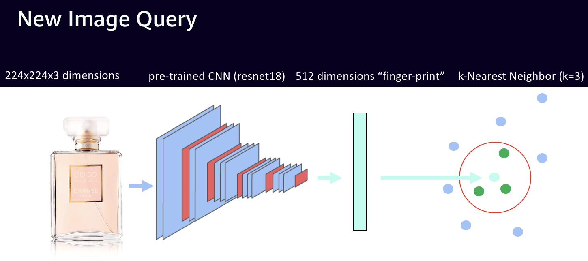
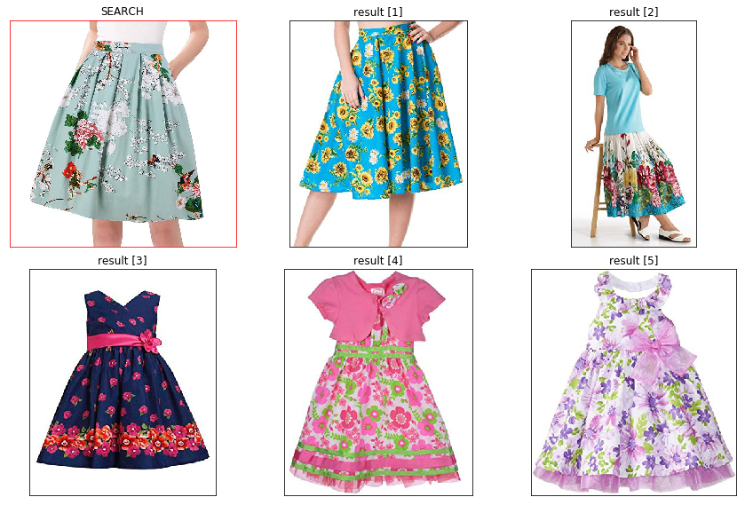

# Visual Search with MXNet Gluon and HNSW

* [Demo website](https://thomasdelteil.github.io/VisualSearch_MXNet/)
* [Youtube video](https://www.youtube.com/watch?v=9a8MAtfFVwI)
* [Presentation slides](https://www.slideshare.net/ThomasDelteil1/visual-search-engine-with-mxnet-gluon-and-hnsw)

## How does it work?

In this tutorial we will create a Visual Search engine for browsing 1M amazon product images.

First step, indexing the image dataset by computing the image embeddings using a pre-trained network as a featurizer:



Second step, query the index using an efficient K-NN search algorithm, here we use [Hierarchical Navigable Small World graphs (HNSW)](https://github.com/nmslib/hnsw)



**Pre-requisite**:
- MXNet: `pip install --pre mxnet-cu91`
- hnswlib (follow the guide here: https://github.com/nmslib/hnsw)


```python
import mxnet as mx
from mxnet import gluon, nd
from mxnet.gluon.model_zoo import vision
import multiprocessing
from mxnet.gluon.data.vision.datasets import ImageFolderDataset
from mxnet.gluon.data import DataLoader
import numpy as np
import wget
import imghdr
import json
import pickle
import hnswlib
import numpy as np
import glob, os, time
import matplotlib.pyplot as plt 
import matplotlib.gridspec as gridspec
import urllib.parse
import urllib
import gzip
%matplotlib inline
```

Data originally from here:
http://jmcauley.ucsd.edu/data/amazon/

*Image-based recommendations on styles and substitutes
J. McAuley, C. Targett, J. Shi, A. van den Hengel
SIGIR, 2015*

## Downloading images
We only use a subset of the total number of images, here 1M
(it takes about 40 minutes to download all the data on an ec2 instance)


```python
subset_num = 1000000
```

Beware, if using the full dataset this will download **300GB** of images, make sure you have the appropriate hardware and connexion!
Alternatively, just set `images_path` to a directory containing images following this format `ID.jpg`


```python
data_path = 'metadata.json'
images_path = '/data/amazon_images_subset'
```


```python
num_lines = 0
num_lines = sum(1 for line in open(data_path))
assert num_lines >= subset_num, "Subset needs to be smaller or equal to total number of example"
```

Download the metadata.json file that contains the URL of the images


```python
if not os.path.isfile(data_path):
    # Downloading the metadata, 3.1GB, unzipped 9GB
    !wget -nv https://s3.us-east-2.amazonaws.com/mxnet-public/stanford_amazon/metadata.json.gz
    !gzip -d metadata.json.gz

if not os.path.isdir(images_path):
    os.makedirs(images_path)
```


```python
def parse(path, num_cpu, modulo):
    g = open(path, 'r')
    for i, l in enumerate(g):
        if (i >= num_lines - subset_num and i%num_cpu == modulo):
            yield eval(l)
```


```python
def download_files(modulo):
    for data in parse(data_path, NUM_CPU, modulo):
        if 'imUrl' in data and data['imUrl'] is not None and 'categories' in data and data['imUrl'].split('.')[-1] == 'jpg':
            url = data['imUrl']
            try:
                path = os.path.join(images_path, data['asin']+'.jpg')
                if not os.path.isfile(path):
                    file = urllib.request.urlretrieve(url, path)
            except:
                print("Error downloading {}".format(url))
```

Downloading the images using 10 times more processes than cores


```python
NUM_CPU = multiprocessing.cpu_count()*10
```


```python
pool = multiprocessing.Pool(processes=NUM_CPU)
results = pool.map(download_files, list(range(NUM_CPU)))
```


```python
# Removing all the fake jpegs
list_files = glob.glob(os.path.join(images_path, '**.jpg'))
for file in list_files:
    if imghdr.what(file) != 'jpeg':
        print('Removed {} it is a {}'.format(file, imghdr.what(file)))
        os.remove(file)
```

## Generate the image embeddings


```python
BATCH_SIZE = 256
EMBEDDING_SIZE = 512
SIZE = (224, 224)
MEAN_IMAGE= mx.nd.array([0.485, 0.456, 0.406])
STD_IMAGE = mx.nd.array([0.229, 0.224, 0.225])
```

### Featurizer
We use a pre-trained model from the model zoo


```python
ctx = mx.gpu()
```

Networks from the model-zoo follow the convention that the features are on the `.features` property and output on the `.output` property. It makes it very easy to transform any pre-trained network in featurizer.


```python
net = vision.resnet18_v2(pretrained=True, ctx=ctx)
net = net.features
```

### Data Transform
to convert the images to a shape usable by the network


```python
def transform(image, label):
    resized = mx.image.resize_short(image, SIZE[0]).astype('float32')
    cropped, crop_info = mx.image.center_crop(resized, SIZE)
    cropped /= 255.
    normalized = mx.image.color_normalize(cropped,
                                      mean=MEAN_IMAGE,
                                      std=STD_IMAGE) 
    transposed = nd.transpose(normalized, (2,0,1))
    return transposed, label
```

### Data Loading


```python
import os, tempfile, glob
empty_folder = tempfile.mkdtemp()
# Create an empty image Folder Data Set
dataset = ImageFolderDataset(root=empty_folder, transform=transform)
```


```python
list_files = glob.glob(os.path.join(images_path, '**.jpg'))
```

Because of the data validation and invalid URL, our actual subset is smaller than the one requested


```python
dataset.items = list(zip(list_files, [0]*len(list_files)))
```

We load the dataset in a dataloader with as many workers as CPU cores


```python
dataloader = DataLoader(dataset, batch_size=BATCH_SIZE, last_batch='keep', shuffle=False, num_workers=multiprocessing.cpu_count())
```

### Featurization


```python
features = np.zeros((len(dataset), EMBEDDING_SIZE), dtype=np.float32)
```


```python
%%time
tick = time.time()
n_print = 100
j = 0
for i, (data, label) in enumerate(dataloader):
    data = data.as_in_context(ctx)
    if i%n_print == 0 and i > 0:
        print("{0} batches, {1} images, {2:.3f} img/sec".format(i, i*BATCH_SIZE, BATCH_SIZE*n_print/(time.time()-tick)))
        tick = time.time()
    output = net(data)
    features[(i)*BATCH_SIZE:(i+1)*max(BATCH_SIZE, len(output)), :] = output.asnumpy().squeeze()
```

    100 batches, 25600 images, 1333.611 img/sec
    200 batches, 51200 images, 2097.873 img/sec
    300 batches, 76800 images, 2108.257 img/sec
    400 batches, 102400 images, 2119.740 img/sec
    500 batches, 128000 images, 2007.043 img/sec
    600 batches, 153600 images, 2104.296 img/sec
    700 batches, 179200 images, 2155.201 img/sec
    800 batches, 204800 images, 2105.456 img/sec
    900 batches, 230400 images, 2106.616 img/sec
    1000 batches, 256000 images, 2128.810 img/sec
    1100 batches, 281600 images, 2125.134 img/sec
    1200 batches, 307200 images, 2141.244 img/sec
    1300 batches, 332800 images, 2103.341 img/sec
    1400 batches, 358400 images, 2116.504 img/sec
    1500 batches, 384000 images, 2090.445 img/sec
    1600 batches, 409600 images, 2138.420 img/sec
    1700 batches, 435200 images, 2088.554 img/sec
    1800 batches, 460800 images, 2127.671 img/sec
    1900 batches, 486400 images, 2118.631 img/sec
    2000 batches, 512000 images, 2084.014 img/sec
    2100 batches, 537600 images, 2111.905 img/sec
    2200 batches, 563200 images, 2125.523 img/sec
    2300 batches, 588800 images, 2106.901 img/sec
    2400 batches, 614400 images, 2123.917 img/sec
    2500 batches, 640000 images, 2064.876 img/sec
    2600 batches, 665600 images, 2117.610 img/sec
    2700 batches, 691200 images, 2112.028 img/sec
    2800 batches, 716800 images, 2066.120 img/sec
    2900 batches, 742400 images, 2068.632 img/sec
    3000 batches, 768000 images, 2095.919 img/sec
    3100 batches, 793600 images, 2104.414 img/sec
    3200 batches, 819200 images, 2090.150 img/sec
    3300 batches, 844800 images, 2068.915 img/sec
    3400 batches, 870400 images, 2113.243 img/sec
    3500 batches, 896000 images, 2105.340 img/sec
    3600 batches, 921600 images, 2127.197 img/sec
    3700 batches, 947200 images, 2123.200 img/sec
    CPU times: user 4min 43s, sys: 3min 22s, total: 8min 5s
    Wall time: 7min 42s


## Create the search index


```python
# Number of elements in the index
num_elements = len(features)
labels_index = np.arange(num_elements)
```


```python
%%time 

# Declaring index
p = hnswlib.Index(space = 'l2', dim = EMBEDDING_SIZE) # possible options are l2, cosine or ip

# Initing index - the maximum number of elements should be known beforehand
p.init_index(max_elements = num_elements, ef_construction = 100, M = 16)

# Element insertion (can be called several times):
int_labels = p.add_items(features, labels_index)

# Controlling the recall by setting ef:
p.set_ef(100) # ef should always be > k
```

    CPU times: user 31min 34s, sys: 16.4 s, total: 31min 51s
    Wall time: 1min


```python
p.save_index('index.idx')
```

### Testing

We test the results by sampling random images from the dataset and searching their K-NN


```python
def plot_predictions(images):
    gs = gridspec.GridSpec(3, 3)
    fig = plt.figure(figsize=(15, 15))
    gs.update(hspace=0.1, wspace=0.1)
    for i, (gg, image) in enumerate(zip(gs, images)):
        gg2 = gridspec.GridSpecFromSubplotSpec(10, 10, subplot_spec=gg)
        ax = fig.add_subplot(gg2[:,:])
        ax.imshow(image, cmap='Greys_r')
        ax.tick_params(axis='both',       
                       which='both',      
                       bottom='off',      
                       top='off',         
                       left='off',
                       right='off',
                       labelleft='off',
                       labelbottom='off') 
        ax.axes.set_title("result [{}]".format(i))
        if i == 0:
            plt.setp(ax.spines.values(), color='red')
            ax.axes.set_title("SEARCH".format(i))
```


```python
def search(N, k):
    # Query dataset, k - number of closest elements (returns 2 numpy arrays)
    q_labels, q_distances = p.knn_query([features[N]], k = k)
    images = [plt.imread(dataset.items[label][0]) for label in q_labels[0]]
    plot_predictions(images)
```

### Random testing


```python
%%time
index = np.random.randint(0,len(features))
k = 6
search(index, k)
```

    CPU times: user 292 ms, sys: 0 ns, total: 292 ms
    Wall time: 287 ms


### Manual testing


```python
path = 'dress.jpg'
```


```python
p.set_ef(300) # ef should always be > k
image = plt.imread(path)[:,:,:3]
image_t, _ = transform(nd.array(image), 1)
output = net(image_t.expand_dims(axis=0).as_in_context(ctx))
labels, distances = p.knn_query([output.asnumpy().reshape(-1,)], k = 5)
images = [image]
images += [plt.imread(dataset.items[label][0]) for label in labels[0]]
```


```python
plot_predictions(images)
```




